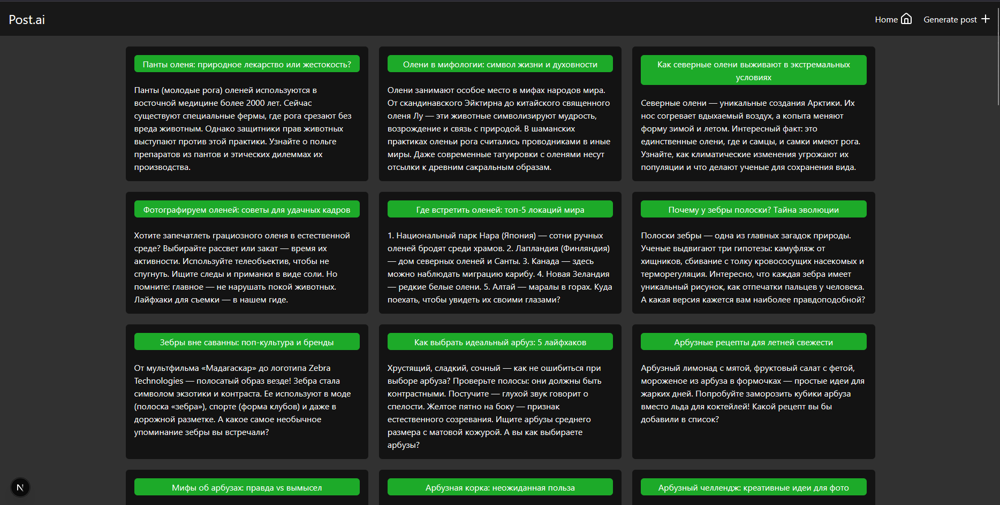
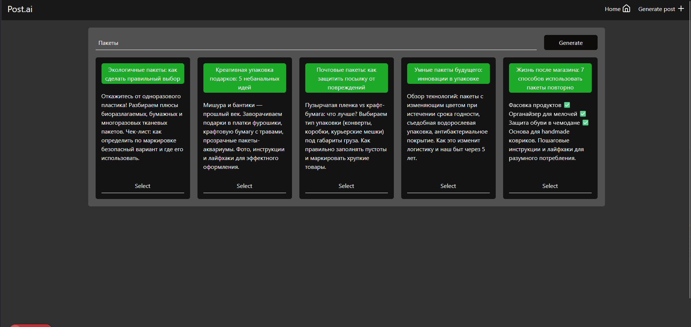

# Mini-project for interview

This application generates and adds to the database posts on a given topic.

## Stack:
### Frontend
React, Next.js, Zustang, TailwindCSS, Framer Motion, Lucide Icons.
### Backend
Hono, Drizzle ORM, PostgreSQL.

## STRUCTURE
```
packages/
├── backend/
│   ├── dist/
│   ├── src/
│   ├── .spec.swcrc
│   ├── eslint.config.mjs
│   ├── jest.config.ts
│   ├── package.json
│   ├── tsconfig.app.json
│   ├── tsconfig.json
│   └── tsconfig.spec.json
│
├── frontend/
│   ├── .next/
│   ├── public/
│   ├── specs/
│   ├── src/
│   ├── .gitkeep
│   ├── .swcrc
│   ├── eslint.config.mjs
│   ├── index.d.ts
│   ├── jest.config.ts
│   ├── next-env.d.ts
│   ├── next.config.js
│   ├── package.json
│   ├── postcss.config.js
│   ├── tailwind.config.js
│   ├── tsconfig.json
│   └── tsconfig.spec.json
```

## Istalliation

#### Deps
```
bun install
```
#### .env
```
DATABASE_URL=
OPENROUTER_API_KEY=
```
#### Start
```
npx nx serve backend
npx nx serve frontend
```

## API ROUTES

|Method | Path                  | Description                                   |
|-------|-----------------------|-----------------------------------------------|
| GET   | `/post`               | Get ALL post                            |
| GET   | `/post/:id`           | Get post by id                                         |
| POST  | `/post`               | Add post                           |
| GET  | `/generate`              | Generate 5 posts                         |
## Demonstrations
/

/page/new
